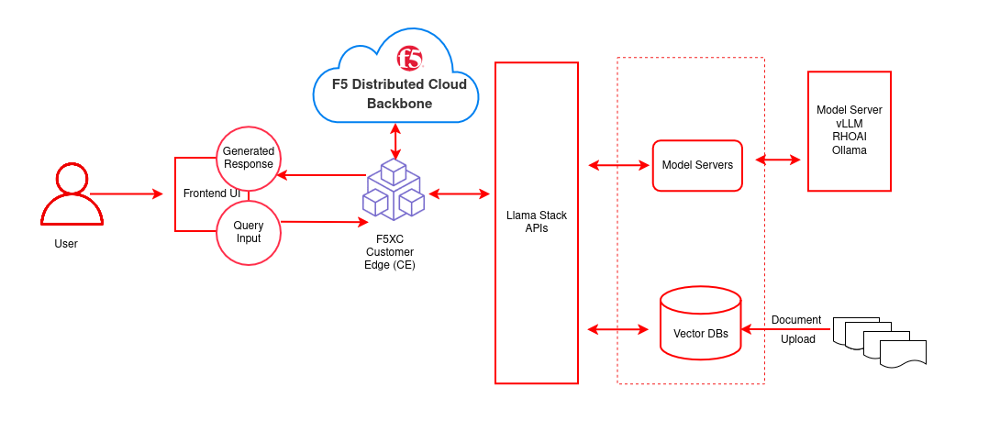

# Secure Model Inference with F5 Distributed Cloud API Security

Secure AI-powered financial services applications against injection attacks, shadow APIs, and abuse while safeguarding sensitive financial data.

## Table of contents

- [Detailed description](#detailed-description)
  - [Architecture diagrams](#architecture-diagrams)
- [Requirements](#requirements)
  - [Minimum hardware requirements](#minimum-hardware-requirements)
  - [Minimum software requirements](#minimum-software-requirements)
  - [Required user permissions](#required-user-permissions)
- [Deploy](#deploy)
  - [Prerequisites](#prerequisites)
  - [Supported models](#supported-models)
  - [Installation steps](#installation-steps)
- [Delete](#delete)
- [References](#references)
- [Document management](#document-management)
- [Tags](#tags)

## Detailed description

Imagine a financial services team deploying an AI-powered assistant to help underwriters review policies, analyze risk documents, and answer questions about compliance guidelines. The assistant uses a large language model served on Red Hat® OpenShift® AI, with Retrieval-Augmented Generation (RAG) grounding its answers in the firm's own document corpus—underwriting manuals, regulatory filings, and internal procedures. Before moving the application to production, a compliance review reveals that the inference endpoint was configured incorrectly: a crafted prompt could trigger cross-site scripting or SQL injection, an undocumented API path may leak model metadata, and there is nothing stopping a single client from flooding the endpoint with thousands of requests.

This AI quickstart demonstrates a solution using F5 Distributed Cloud (XC) Web App & API Protection. It deploys a complete RAG chatbot on OpenShift AI and secures the model inference endpoints. You get a working application you can demonstrate to security, compliance, and risk stakeholders—complete with simulated attack scenarios that show exactly how each protection layer responds to threats from external attackers and internal misuse alike.

While the included demo content targets financial services, the same architecture applies to any industry handling sensitive data—healthcare organizations protecting patient records, government agencies securing citizen-facing AI services, or any enterprise that needs to lock down LLM endpoints before moving to production.

This quickstart allows you to explore security capabilities by:

- Querying financial documents through a RAG-powered chat assistant and seeing grounded, context-aware answers
- Simulating XSS and SQL injection attacks against the inference endpoint, then enabling a WAF policy to block them
- Uploading an OpenAPI specification to enforce API contracts and automatically block undocumented shadow APIs
- Configuring rate limiting to prevent endpoint abuse and ensure fair resource allocation across clients
- Walking through each scenario end-to-end with the included [security use case guide](docs/securing_model_inference_use_cases.md)

The solution is built on:

- **Red Hat OpenShift AI** – MLOps platform with KServe/vLLM model serving and GPU acceleration
- **F5 Distributed Cloud API Security** – WAF, API spec enforcement, rate limiting, and sensitive data controls
- **LLaMA Stack + Streamlit** – RAG chatbot interface backed by PGVector for semantic document retrieval
- **Helm-based deployment** – One-command install and teardown on any OpenShift cluster

### Architecture diagrams



| Layer/Component | Technology | Purpose/Description |
|-----------------|------------|---------------------|
| **Orchestration** | OpenShift AI | Container orchestration and GPU acceleration |
| **Framework** | LLaMA Stack | Core building blocks for AI application development |
| **UI Layer** | Streamlit | Chatbot interface for chat-based interaction |
| **LLM** | Llama-3.2-3B-Instruct | Generates contextual responses from retrieved documents |
| **Embedding** | all-MiniLM-L6-v2 | Text to vector embeddings |
| **Vector DB** | PostgreSQL + PGVector | Stores embeddings and semantic search |
| **Retrieval** | Vector Search | Retrieves relevant documents by similarity |
| **Storage** | S3 Bucket | Document source for enterprise content |

## Requirements

### Minimum hardware requirements

- **LLM inference**: GPU node (e.g. NVIDIA L4 or equivalent; see Supported Models table). The 70B model requires A100 x2 or equivalent.
- **Embedding-only**: CPU is sufficient for `all-MiniLM-L6-v2`.
- **Cluster resources**: minimum 8 vCPUs, 32 GB RAM, 100 GB disk for model weights and vector database.

### Minimum software requirements

- OpenShift Client CLI ([oc](https://docs.redhat.com/en/documentation/openshift_container_platform/4.18/html/cli_tools/openshift-cli-oc#installing-openshift-cli))
- Red Hat OpenShift Container Platform 4.18+
- Red Hat OpenShift AI 2.16+ (tested with 2.22)
- Helm CLI
- Ansible (for F5 XC deployment): `pip install ansible kubernetes`

- Optional: [huggingface-cli](https://huggingface.co/docs/huggingface_hub/guides/cli), [Hugging Face token](https://huggingface.co/settings/tokens), [jq](https://stedolan.github.io/jq/) for example scripts

### Required user permissions

- Regular user for default deployment
- Cluster admin for advanced configurations (e.g. F5 XC integration)


## Deploy

### Prerequisites

- OpenShift cluster with OpenShift AI installed
- `oc` logged into the cluster
- Helm installed
- Hugging Face token and access to [Meta Llama](https://huggingface.co/meta-llama/Llama-3.2-3B-Instruct/) (and optionally [Llama Guard](https://huggingface.co/meta-llama/Llama-Guard-3-8B/) for safety)

### Supported models

| Function   | Model Name                             | Hardware    | AWS example      |
|-----------|----------------------------------------|-------------|------------------|
| Embedding | `all-MiniLM-L6-v2`                     | CPU/GPU/HPU | —                |
| Generation| `meta-llama/Llama-3.2-3B-Instruct`     | L4/HPU/XEON | g6.2xlarge       |
| Generation| `meta-llama/Llama-3.1-8B-Instruct`     | L4/HPU/XEON | g6.2xlarge       |
| Generation| `meta-llama/Meta-Llama-3-70B-Instruct` | A100 x2/HPU | p4d.24xlarge     |
| Safety    | `meta-llama/Llama-Guard-3-8B`          | L4/HPU      | g6.2xlarge       |

The 70B model is not required for initial testing. Llama-Guard-3-8B is optional.

### Installation steps

1. **Log in to OpenShift**
   ```bash
   oc login --token=<your_sha256_token> --server=<cluster-api-endpoint>
   ```

2. **Clone and go to the deployment directory**
   ```bash
   git clone https://github.com/rh-ai-quickstart/f5-api-security.git
   cd f5-api-security/deploy/helm
   ```

3. **Configure and deploy**

   Start by creating your values file:
   ```bash
   cp rag-values.yaml.example rag-values.yaml
   ```

   Then choose **one** of the two deployment methods below and edit `rag-values.yaml` accordingly.

   ---

   #### Option A: Deploy models locally (GPU required)

   Best when you have GPU nodes on your cluster and want to run models entirely on-premises.

   In `rag-values.yaml`, enable one or more local models by setting `enabled: true`:

   ```yaml
   global:
     models:
       # Quantized — 1 GPU, ~2–3 GB VRAM
       llama-3-2-1b-instruct-quantized:
         id: RedHatAI/Llama-3.2-1B-Instruct-quantized.w8a8
         enabled: true

       # Full precision — 1 GPU, ~6–8 GB VRAM
       llama-3-2-3b-instruct:
         id: meta-llama/Llama-3.2-3B-Instruct
         enabled: true
   ```

   > **Note:** If your GPU node has a taint (e.g., `nvidia.com/gpu`), add the corresponding toleration to the model's config block. See `rag-values.yaml` for examples.

   ---

   #### Option B: Use a remote LLM (no local GPU required)

   Best when you want to connect to an existing model server—such as an external vLLM instance, OpenAI-compatible endpoint, or another cluster's inference service—without provisioning local GPUs.

   In `rag-values.yaml`, enable the remote model and supply the connection details:

   ```yaml
   global:
     models:
           # No local GPU required (runs on remote server)
       remoteLLM:
             id: <MODEL_ID>
             url: <MODEL_SERVER_URL>
             apiToken: <API_TOKEN>
         enabled: true
   ```

   > **Tip:** You can combine both options—for example, run the embedding model locally while pointing the generation model at a remote server.

   ---
   #### Option C: Deploy models locally using Intel Xeon processors
   Best when you have Intel Xeon nodes on your cluster and want to run models entirely on-premises.

   In `rag-values.yaml`, enable one or more local models by setting `enabled: true`:

   ```yaml
   global:
     models:
       llama-3-2-3b-instruct:
        id: meta-llama/Llama-3.2-3B-Instruct
        enabled: true
        device: "xeon"
        args:
        - --max-model-len
        - "14336"
        - --max-num-seqs
        - "32"
   ```
   ---

   Once your values file is ready, deploy:
   ```bash
   make install NAMESPACE=<NAMESPACE>
   ```

   The Makefile validates dependencies (`helm`, `oc`), creates the namespace, and installs the Helm chart. A successful run ends with:
   ```
   [SUCCESS] rag installed successfully
   ```

4. **Verify (optional)**:
   
   This step uses port-forwarding to locally validate the LlamaStack service

   Port-forward the LlamaStack service:
   ```bash
   oc port-forward svc/llamastack 8321:8321
   ```
   
   List models:
   ```bash
   curl -sS http://localhost:8321/v1/models
   ```
   Expected result: a JSON response containing one or more model IDs.
   
   Test chat (LlamaStack):

   Replace <MODEL_ID> with a model ID returned by the previous command.
   ```bash
   curl -sS http://localhost:8321/v1/chat/completions \
     -H "Content-Type: application/json" \
     -d '{"model": "<MODEL_ID>", "messages": [{"role": "user", "content": "Say hello in one sentence."}], "max_tokens": 64, "temperature": 0}' | jq
   ```
   For the secured vLLM endpoint, use your route and model ID in the same request format.

5. **Deploy F5 Distributed Cloud Customer Edge**

   This step deploys the F5 XC CE mesh onto the OpenShift cluster. It configures HugePages, validates storage, applies the CE manifest, and waits for all pods to register and become healthy.

   ```bash
   # Create the secrets file with F5 XC credentials
   cp deploy/ansible/group_vars/all/secrets.yml.example \
      deploy/ansible/group_vars/all/secrets.yml

   # Edit secrets.yml — set f5xc_api_token, f5xc_token, and f5xc_cluster_name (f5xc_tenant is optional)
   vim deploy/ansible/group_vars/all/secrets.yml

   # Run the deployment
   make f5-deploy
   ```

   By default (`f5xc_auto_approve: true`), the playbook approves the CE site registration via the F5 XC API using `f5xc_api_token` (Console: **Administration → Credentials → API Token**). Your tenant subdomain is resolved automatically from the API token; override with `f5xc_tenant` in `secrets.yml` or `F5XC_TENANT` if needed. The playbook polls until the site reaches **ONLINE**, then continues with CE pod health checks.

   To approve manually in the Console instead, set `f5xc_auto_approve: false` in `deploy/ansible/group_vars/all/vars.yml`. The playbook will display a banner and poll until approval is detected.

6. **Next steps**
   - [Security Use Cases and Testing](docs/securing_model_inference_use_cases.md)

**Application access:** Get the route with `oc get route -n <NAMESPACE>`, open the URL in a browser, and configure LLM settings (XC URL, model ID, API key) in the web UI.

### Delete

Remove the RAG stack:

```bash
cd f5-api-security/deploy/helm
make uninstall NAMESPACE=<NAMESPACE>
```

Remove the F5 XC Customer Edge deployment:

```bash
make f5-clean                        # keeps HugePages config
make f5-clean REMOVE_HUGEPAGES=true  # also removes HugePages, Tuned, MCP, and node label
```

To delete the RAG namespace entirely:

```bash
oc delete project <NAMESPACE>
```

## References

- **Make commands:**

  ```bash
  make help             # Show all available commands
  make install          # Deploy the RAG application
  make uninstall        # Remove the RAG application
  make clean            # Clean up all RAG resources including namespace
  make f5-deploy        # Deploy F5 XC Customer Edge mesh (Ansible)
  make f5-clean         # Remove F5 XC deployment and cluster resources
  make logs             # Show logs for all pods
  make monitor          # Monitor deployment status
  make status           # Check deployment status
  make validate-config  # Validate configuration values
  ```

- [F5 Distributed Cloud](https://www.f5.com/cloud)
- [Red Hat OpenShift AI documentation](https://docs.redhat.com/en/documentation/red_hat_openshift_ai_self-managed)
- [KServe](https://kserve.github.io/website/)
- [vLLM project](https://docs.vllm.ai/)

## Document management

Documents can be uploaded directly through the UI for RAG-based retrieval.

**Supported formats:**
- **PDF documents** — Underwriting guidelines, compliance policies, risk assessment reports
- **Text files** — Regulatory filings, internal procedure documents

Navigate to **Settings → Vector Databases** to create vector databases and upload documents.

## Tags

- **Title:** Secure model inference with F5 Distributed Cloud API Security
- **Industry:** Banking and securities
- **Product:** OpenShift AI, OpenShift
- **Contributor org:** F5 / Red Hat
